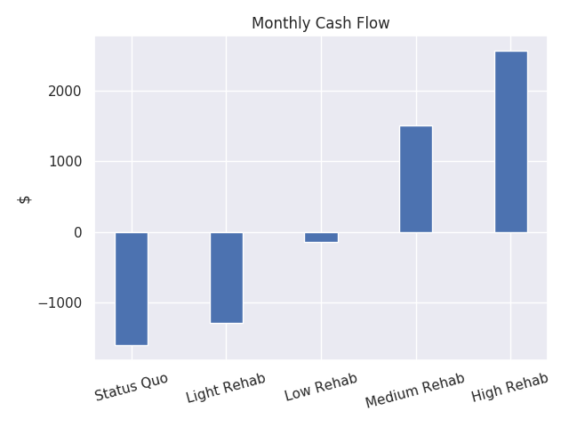
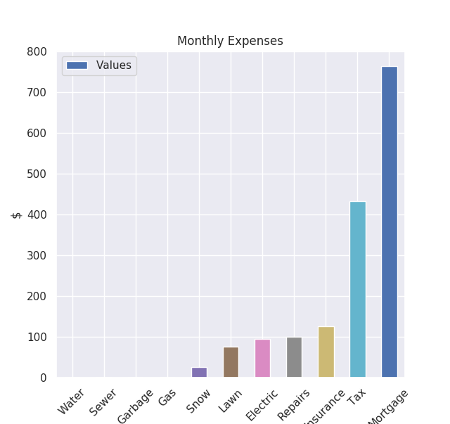

# Barbara House Investment

## Summary
548 W Delhi Rd. has expenses of 1,600/month. With a minimal investment (carpet,
paint, driveway)  and a few months time, I could rent it out on Airbnb for 
912/month. With a more extensive investment (new kitchen, bath, deck), I
could rent it out for 2,737.50/month. Additionally, if we convert the garage in
addition to previous improvements, I project rent of 4,562.50/month. 

The only sticking point is getting my mom set up with a place in Pittsburgh, 
which she's expressed interest in for music school. If you have a vacant apartment
available with market rent below what I can rent the house out for, you could
gain the spread by reducing the liability from my mom. It doesn't make sense to 
make anything more than a minimal investment while the house is posted for 
Lynn's collateral. 

## Home
- 4 bedrooms currently. Minimal work needed to add a 5th in the house.
- 2.5 baths. Potential to be 3.
- 2,374 sq. ft.
- given current state, I don't think you would get a deal for more than 80% of
  [current market value](https://www.zillow.com/homedetails/548-W-Delhi-Rd-Ann-Arbor-MI-48103/54800224_zpid/) (0.8\*434,000 = 347,200)

## Expenses
- Mortgage: I calculated the monthly payments for a 30-year loan with a
  principal of ~190,000. This comes out to 762.15/month
- Tax: I found information from the city that shows a monthly tax bill of
  432/month
- Insurance: I estimate insurance for a short-term rental at 125/month
- Repairs: I use 100/month to estimate monthly repairs
- Utilities: I found the average Michigan utility bill, which is 94.52/month
- Lawn: during summer months, I use 100/month to estimate lawncare
- Snow: during winter months, I use 100/month to estimate snow removal.
- Cleaning: 2hrs/cleaning \* 25/hr \* 30.5 nights/month \* 0.75 occupancy is
  1,144/month.
    - Only makes sense after High Rehab

- Monthly: 1,600
- Yearly: 20,000

## Rehab
- Low
    - Carpets: 2,000
    - Paint: 1,000
    - Sewer: 300-15,000
    - Driveway: 1,000
- Medium
    - Low: 4,300-19,000
    - Kitchen: 5,000
    - Bathrooms: 8,000
    - Deck: 5,000
- High
    - Medium: 22,300-37,000
    - Garage: 50,000

## Airbnb Comps
There are at least 10 Airbnbs around 548 W Delhi Rd. with a nightly rate range 
of 40-80/night. I think we would get great occupancy at 20/night in its current
condition, 40/night after Low Rehab, 60/night after Medium Rehab, and 80/night
after High Rehab. 

## Cash Flow
- Two Income Expenses: vacancy and property management
    - using 25% vacancy is conservative. I've seen a range of 0-50% vacancy
      rates.
    - I will ask for 1/2 of monthly revenue to get the house cleaned up and
      manage everything after. 
- Light Rehab: 4br\*20/night\*365 nights\*0.75 occupancy\*0.5 prop_man/12 months 
  = 912/month
    - net operating income: -688/month (912 - 1600 )
- Low Rehab: 4br\*40/night\*365 nights\*0.75 occupancy\*0.5 prop_man/12 months 
  = 1,825/month
    - net operating income: 225/month (1825 - 1600)
- Medium Rehab: 4br\*60/night\*365 nights\*0.75 occupancy\*0.5 prop_man/12 months 
  = 2,737.50/month
    - net operating income: 1,137.50/month (2737.5 - 1600)
- High Rehab: 5br\*80/night\*365 nights\*0.75 occupancy\*0.5 prop_man/12 months 
  = 4,562.50/month
    - net operating income: 1,818.50/month (4562.5 - 1600 - 1144 cleaning)

## After Rehab Value
- Current Value
    - [Zillow](https://www.zillow.com/homedetails/548-W-Delhi-Rd-Ann-Arbor-MI-48103/54800224_zpid/): 434,000
- Low
    - 5 years of net operating income (13,500) + current value (434,000) =
      447,500
    - 10 years of net operating income (27,000) + current value (434,000) = 
      461,000
- Medium
    - 5 years of net operating income (68,250) + current value (434,000) =
      502,250
    - 10 years of net operating income (136,500) + current value (434,000) = 
      570,500
- High
    - 5 years of net operating income (109,110) + current value (434,000) =
      543,110
    - 10 years of net operating income (218,220) + current value (434,000) = 
      652,220

## Cash on Cash Return
- Low
    - Cash investment: 4,300-19,000
    - Change in equity: 434,000 - 347,200 = 86,800
    - Time elapsed: 2 months
    - Return: 4.6-20x Cash Investment 
- Medium
    - Cash investment: 22,300-37,000
    - Change in equity: 502,250 - 347,200 = 155,050
    - Time elapsed: 4 months
    - Return: 4-7x Cash Investment 
- High
    - Cash investment: 72,300-87,000
    - Change in equity: 543,100- 347,200 = 195,910
    - Time elapsed: 12 months
    - Return: 2.25-2.70x Cash Investment 

## Conclusion
The only sticking point right now is getting my mom out of the house. If we
could get her set up in Pittsburgh, I think she would agree to leave.
Currently, the house is returing -1,600/month. Within two months, I think we could
get it down to a return of -688/month. Within 4 months, we could get it to
+225/month. Within a year, we could get it to +1,818.50/month
